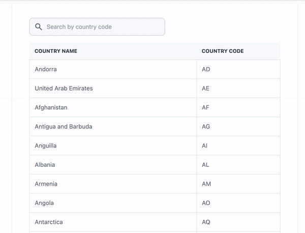

# Country Seach

## Getting Started with Country Search

- Run `yarn` or `npm install`.
- Run `yarn start` or `npm start` to run the project.
- Run `yarn test` or `npm test` to run tests.

# How it's made

- All types related to Graphql API are generated automatically using `graphql-codegen`, if API has been updated we can update types with `npm run codegen`
- Data is fetched through `@apollo/client`
- Filtering is done on client side for better user experience, Can switch to server side filtering if needed as API has support for it.

## See It In Action

